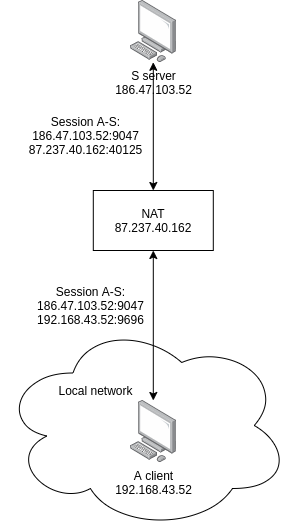

# echo-udp-rs

UDP echo server and client. Server listens specified address for incoming
messages and sends replies to clients. Demonstrates half of a NAT traversal
hole punching technique: server returns message with client's IP and port. If a
client is behind a NAT, the server can send messages back to the client using
its temporary public endpoint.

## Example

```bash
$ cargo run -- client -d "Hello from client" -r 186.47.103.52:9047 -l 192.168.43.52:9696
Client bound to 192.168.43.52:9696...
Client sent 'Hello from client' to 186.47.103.52:9047. Waiting reply...
Client recieved from 186.47.103.52:9047: 'Hello from server! Your address: 87.237.40.162:40125'.

$ cargo run -- server
Server listening 0.0.0.0:9047
Server recieved: 'Hello from client' from 87.237.40.162:40125. Sending reply...
```

## Network topology diagram


